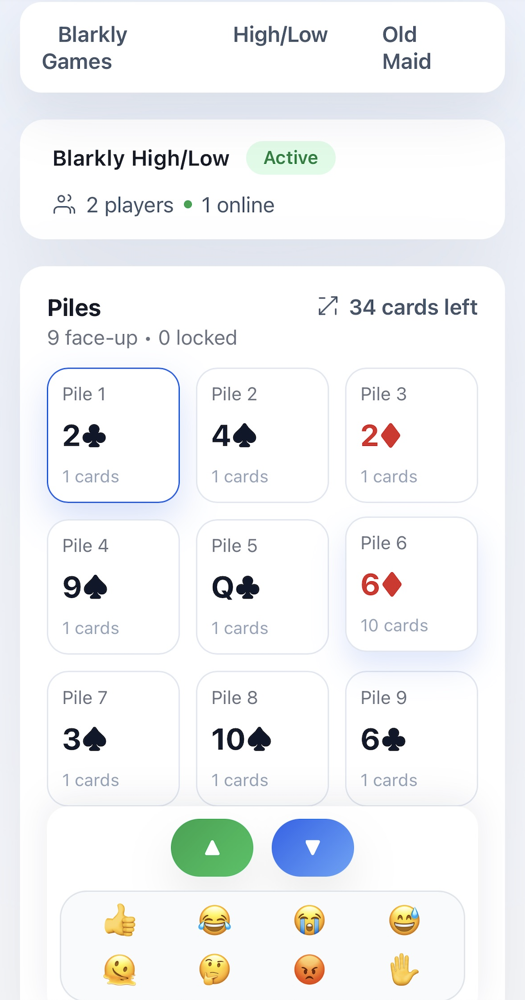

# 

**Forgot a deck of cards? Don't let that stop family game night**



## Build & Deploy

Run the following commands from the repo root when you're ready to publish:

```bash
cd functions && npm run build && cd ..
cd frontend && npm run build && cd ..
firebase deploy --only hosting,functions
```
